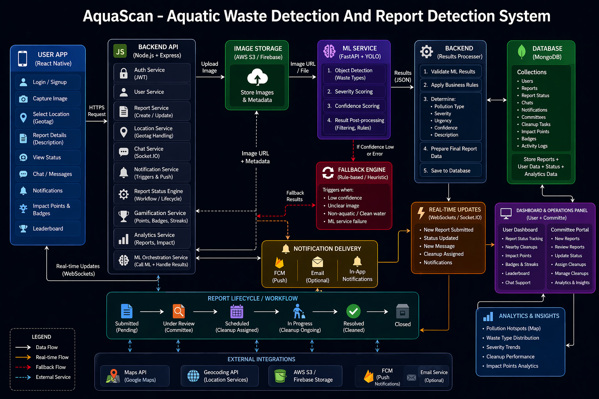

# 🌊 AquaScan

> AI-assisted aquatic waste reporting and cleanup coordination platform.

<p align="center">
  
  
  
  
</p>

---

## Overview

AquaScan is a project focused on helping users report aquatic waste and water pollution through an image-based workflow.

The idea is simple:

- a user uploads an image of a polluted water body,
- the system sends it for AI-based analysis,
- the report is stored with location and metadata,
- and the dashboard helps track report status and cleanup flow.

This project was built as an end-to-end applied AI + full-stack system, combining frontend development, backend APIs, database integration, and a separate machine learning inference service.

---

## One-Line Pitch

**AquaScan helps turn pollution sightings into structured environmental reports using computer vision and a reporting workflow.**

---

## Architecture Diagram

<p align="center">
  
</p>

> **Note:** This diagram represents the broader system architecture and product direction of AquaScan.  
> The current repository may contain only the parts implemented so far.

---

## What is actually used in this project

### Currently used
- Frontend: React
- Frontend tooling: Vite
- Backend: Node.js + Express
- ML service: Python
- Modeling approach: YOLO-based waste detection
- Database: MongoDB
- API communication: REST APIs

### Used in some parts / depending on setup
- FastAPI (ML inference layer)
- React Native / Expo (planned mobile)
- Cloud storage (only if configured)

---

## Core Features

### User-side
- Upload pollution image
- Add location/geotag
- AI-based analysis
- View report results
- Track report status

### Committee-side
- View reports
- Update status
- Manage cleanup actions

### AI pipeline
- Image input → YOLO detection → structured output

---

## Tech Stack

| Layer | Tech |
|------|------|
| Frontend | React + Vite |
| Backend | Node.js + Express |
| Database | MongoDB |
| ML | Python |
| Model | YOLO |
| CV Tools | OpenCV |

---

## Flow

```text
User uploads image
        ↓
Frontend → Backend
        ↓
ML Service (YOLO)
        ↓
Backend stores result
        ↓
Dashboard displays report
